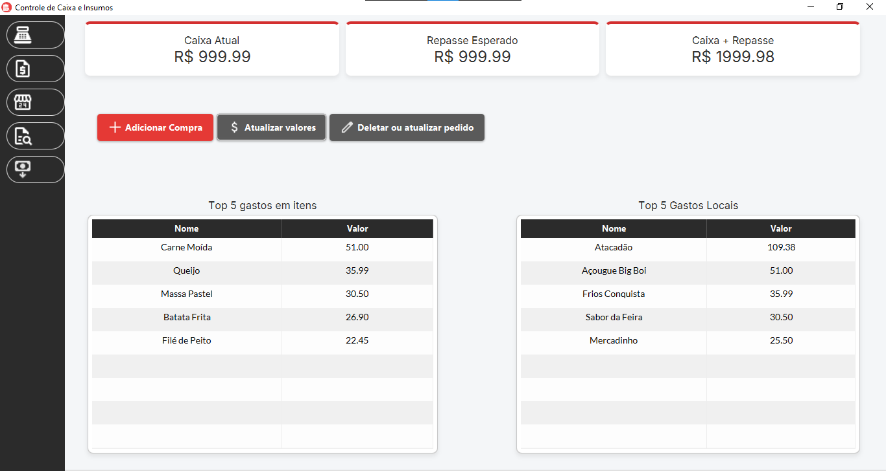

# 📦 Management Control

Um sistema desktop desenvolvido para facilitar o **gerenciamento de gastos e o controle financeiro interno** de pequenos negócios. O projeto une a solidez do **Spring Boot** no back-end com uma interface gráfica fluida construída em **JavaFX**, oferecendo uma visão clara de onde e como os recursos estão sendo aplicados.

## 🚀 Funcionalidades

O sistema foi desenhado para registrar despesas e monitorar o fluxo de caixa, contando com as seguintes ferramentas:

* **Dashboard Interativo:** Visão geral do saldo atual em caixa e tabelas de ranking destacando o **Top 5 de gastos da semana** (por itens comprados) e o **Top 5 de locais** onde houve mais despesas.
* **Registro de Pedidos (Add Order):** Tela dedicada ao lançamento de despesas diárias (por exemplo, compras insumos em atacados).
* **Totais Diários (Daily Total):** Consulta rápida do valor bruto gasto em datas específicas, separando os valores de acordo com os métodos de pagamento utilizados (Dinheiro, Cartão e Pix).
* **Gastos por Local (Location Total):** Relatório que lista e totaliza as compras realizadas em cada estabelecimento/fornecedor dentro de um período selecionado.
* **Histórico de Itens (Order Item History):** Visão detalhada de todos os itens comprados em um determinado período. Mostra o valor unitário médio e o valor total gasto em cada produto específico, facilitando a análise de inflação e custos de insumos.
* **Gestão de Transações:** Tela de controle de fluxo (entradas e saídas). As entradas no caixa são inseridas manualmente pelo usuário, enquanto as saídas são debitadas automaticamente pelo sistema sempre que uma compra (pedido) é paga via Dinheiro ou Pix.

## 📸 Telas do Sistema

Aqui estão algumas visões do sistema em funcionamento:

**Dashboard Principal** *Visão geral do saldo e rankings de gastos.*
<br>


**Registro de Pedidos (Add Order) e Busca de Produtos** *Lançamento de despesas diárias.*
<br>

<br>


**Totais Diários (Daily Total)** *Consulta rápida de gastos por método de pagamento.*
<br>


**Gastos por Local (Location Total)** *Compras realizadas em cada estabelecimento.*
<br>


**Histórico de Itens (Order Item History)** *Visão detalhada do valor unitário médio e total gasto por produto.*
<br>


## 🛠️ Tecnologias Utilizadas

Este projeto foi construído utilizando as seguintes tecnologias e frameworks:

* **Java** (Linguagem principal)
* **Spring Boot** (Injeção de dependências, gerenciamento de dados e serviços)
* **JavaFX** (Construção da Interface Gráfica do Usuário - GUI)
* **Spring Data JPA / Hibernate** (Mapeamento Objeto-Relacional e persistência)
* **H2 Database** (Banco de dados local/embarcado, ideal para aplicações desktop standalone)
* **Maven** (Gerenciamento de dependências e build)
* **Scene Builder / FXML** (Prototipação e design das telas)

## 📁 Estrutura do Projeto

A arquitetura do projeto segue o padrão MVC (Model-View-Controller) adaptado para o contexto do Spring com JavaFX:

* `Entities/`: Classes de modelo (Product, Order, Cashier, Transaction, etc.).
* `Repositories/`: Interfaces de acesso ao banco de dados utilizando Spring Data.
* `Services/`: Regras de negócio da aplicação.
* `Gui/Controllers/`: Controladores do JavaFX que gerenciam as interações do usuário com as telas (`.fxml`).
* `src/main/resources/fxml/`: Arquivos de layout e design das telas.
* `src/main/resources/css/`: Estilização customizada da interface.

## ⚙️ Como Executar o Projeto

### Pré-requisitos
* Java Development Kit (JDK) 17 ou superior.
* Apache Maven instalado.

### Passos para rodar localmente

1. **Clone o repositório:**
   ```bash
   git clone https://github.com/MReis05/ManagementControl.git
   ```
2. **Navegue até a pasta do projeto:**
    ```bash
    cd management-control
    ```
3. **Instale as dependências e compile o projeto:**
    ```bash
    mvn clean install
    ```
4. **Inicie a aplicação:**
   Você pode rodar o projeto diretamente pela sua IDE (executando a classe principal do Spring), ou via linha de comando com o Maven:
   ```bash
   mvn spring-boot:run
   ```

**Autor:** Matheus Reis Cardoso - Desenvolvedor        


